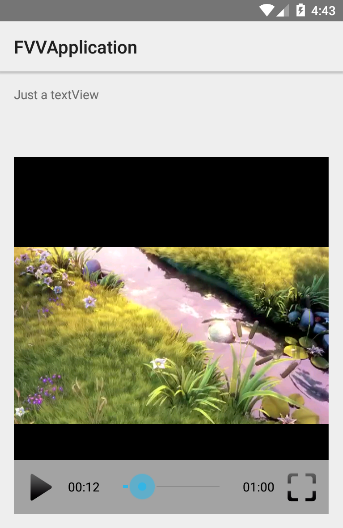
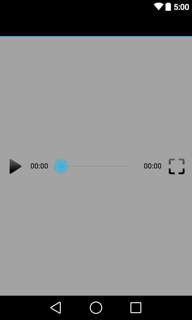

# FullscreenVideoView

An Android Library to replace VideoView. 

Adds fullscreen funcionality, encapsulating [MediaPlayer](http://developer.android.com/reference/android/media/MediaPlayer.html) as video player.

In addition to replace VideoView, FullscreenVideoView can organize some child views, as it extends RelativeLayout ;)

### Gradle

```
compile 'com.github.rtoshiro.fullscreenvideoview:fullscreenvideoview:1.0.0'
```

### Basics

Suppose we have a screen view like:



##### XML

```xml
<?xml version="1.0" encoding="utf-8"?>
<RelativeLayout xmlns:android="http://schemas.android.com/apk/res/android"
             android:layout_width="match_parent"
             android:layout_height="match_parent">
    <com.github.rtoshiro.view.video.FullscreenVideoView
        android:id="@+id/videoview"
        android:background="#000"
        android:layout_width="match_parent"
        android:layout_height="100dp" />
    <TextView
        android:id="@+id/txt_list"
        android:layout_below="@+id/videoview"
        android:layout_width="match_parent"
        android:layout_height="match_parent"
        android:gravity="center"
        android:textColor="#000000"
        android:background="#fff"
        android:text="Hello" />
</RelativeLayout>
```

That's all :)
Now you can call fullscreen() method.

#### FullscreenVideoLayout

I've created FullscreenVideoLayout using FullscreenVideoView with some UI (play/pause buttons, fullscreen button and seekbar)

If you don't want to create your own video controls, you can use FullscreenVideoLayout.

Let's describe the process to customize your view controls'.

#### UI

The first thing we have to do, is create the UI:



#### XML

```xml
<?xml version="1.0" encoding="utf-8"?>
<RelativeLayout xmlns:android="http://schemas.android.com/apk/res/android"
                android:layout_width="match_parent"
                android:layout_height="match_parent"
                android:layout_margin="0dp"
                android:background="#cccccccc">
    <ImageButton
        android:id="@+id/vcv_img_play"
        android:layout_width="wrap_content"
        android:layout_height="wrap_content"
        android:layout_alignParentLeft="true"
        android:layout_centerVertical="true"
        android:layout_margin="10dp"
        android:background="@drawable/fvl_selector_play"/>

    <TextView
        android:textColor="@android:color/black"
        android:id="@+id/vcv_txt_elapsed"
        android:layout_width="wrap_content"
        android:layout_height="wrap_content"
        android:layout_centerVertical="true"
        android:layout_toRightOf="@+id/vcv_img_play"
        android:text="00:00"
        />

    <ImageButton
        android:id="@+id/vcv_img_fullscreen"
        android:layout_width="wrap_content"
        android:layout_height="wrap_content"
        android:layout_alignParentRight="true"
        android:layout_centerVertical="true"
        android:layout_margin="10dp"
        android:background="@drawable/fvl_selector_fullscreen"/>

    <TextView
        android:textColor="@android:color/black"
        android:id="@+id/vcv_txt_total"
        android:layout_width="wrap_content"
        android:layout_height="wrap_content"
        android:layout_centerVertical="true"
        android:layout_toLeftOf="@+id/vcv_img_fullscreen"
        android:text="00:00"/>

    <SeekBar
        android:id="@+id/vcv_seekbar"
        android:minHeight="13dp"
        android:maxHeight="13dp"
        android:progressDrawable="@drawable/fvl_progress"
        android:indeterminateDrawable="@drawable/fvl_progress"
        android:thumb="@drawable/fvl_control_normal"
        android:thumbOffset="16dp"
        android:paddingLeft="16dp"
        android:paddingRight="16dp"
        style="@android:style/Widget.ProgressBar.Horizontal"
        android:layout_width="match_parent"
        android:layout_height="wrap_content"
        android:layout_centerVertical="true"
        android:layout_margin="10dp"
        android:layout_toLeftOf="@+id/vcv_txt_total"
        android:layout_toRightOf="@+id/vcv_txt_elapsed"/>
</RelativeLayout>
```

As FullscreenVideoView extends RelativeLayout (ViewGroup) we can add some child views. You could use XML and write inside the FullscreenVideoView tag, but as we are creating a new Class (extending FullscreenVideoView), we are going to create the control view inside the constructor.

So, first thing is to create a new Class extending FullscreenVideoView:

```java
public class FullscreenVideoLayout extends FullscreenVideoView
{

}
```

And then, we override our FullscreenVideoView.init() method:

```java
    @Override
    protected void init() {
        super.init();

        LayoutInflater inflater = (LayoutInflater) context.getSystemService
                (Context.LAYOUT_INFLATER_SERVICE);
        this.videoControlsView = inflater.inflate(R.layout.view_videocontrols, null);
        RelativeLayout.LayoutParams params = new RelativeLayout.LayoutParams(ViewGroup.LayoutParams.MATCH_PARENT, ViewGroup.LayoutParams.WRAP_CONTENT);
        params.addRule(ALIGN_PARENT_BOTTOM);
        videoControlsView.setLayoutParams(params);
        addView(videoControlsView);

        this.seekBar = (SeekBar) this.videoControlsView.findViewById(R.id.vcv_seekbar);
        this.imgfullscreen = (ImageButton) this.videoControlsView.findViewById(R.id.vcv_img_fullscreen);
        this.imgplay = (ImageButton) this.videoControlsView.findViewById(R.id.vcv_img_play);
        this.textTotal = (TextView) this.videoControlsView.findViewById(R.id.vcv_txt_total);
        this.textElapsed = (TextView) this.videoControlsView.findViewById(R.id.vcv_txt_elapsed);
		
        // Start controls invisible. Make it visible when it is prepared
        this.videoControlsView.setVisibility(View.INVISIBLE);
    }
```
Now we have our control bar inside our view. 

Next, we need to implement what to do with our buttons. So, at the end of init() method, we add:

```java
        this.imgplay.setOnClickListener(this);
        this.imgfullscreen.setOnClickListener(this);
        this.seekBar.setOnSeekBarChangeListener(this);
```

And then, we need to interact with our buttons:

```java
    @Override
    public void onClick(View v) {
        if (v.getId() == R.id.vcv_img_play)
        {
            Drawable drawable = null;
            if (isPlaying()) {
                drawable = context.getResources().getDrawable(R.drawable.fvl_selector_play);
                pause();
            } else {
                drawable = context.getResources().getDrawable(R.drawable.fvl_selector_pause);
                start();
            }
            v.setBackgroundDrawable(drawable);
        } else {
            fullscreen();
        }
    }
```

Now, we need to hide/show our control view when user clicks inside our view.

First, we add at the end of init():

```java
        super.setOnTouchListener(this);
```

And then:

```java
    @Override
    public boolean onTouch(View v, MotionEvent event) {
        if (videoControlsView != null) {
            if (videoControlsView.getVisibility() == View.VISIBLE)
                hideControls();
            else
                showControls();
        }

        if (touchListener != null) {
            touchListener.onTouch(FullscreenVideoLayout.this, event);
        }

        return false;
    }
```

Where hideControls() and showControls() just calls videoControlsView.setVisibility()

Now, we want to update the seekBar with the progress of the video.

To implement that, we need a Handler and a Runnable to check FullscreenVideoVideo.getCurrentPosition() in a 500ms interval.

```java
    // Counter
    protected static final Handler TIME_THREAD = new Handler();
    protected Runnable updateTimeRunnable = new Runnable() {
        public void run() {

            TIME_THREAD.postDelayed(this, 500);
        }
    };
```
And then, we update our seekBar writing inside our Runnable:

```java
            int elapsed = getCurrentPosition();
            if (elapsed > 0) {
                elapsed = elapsed / 1000;
                seekBar.setProgress(elapsed);

                long s = elapsed % 60;
                long m = (elapsed / 60) % 60;
                long h = (elapsed / (60 * 60)) % 24;

                if (h > 0)
                    textElapsed.setText(String.format("%d:%02d:%02d", h, m, s));
                else
                    textElapsed.setText(String.format("%02d:%02d", m, s));
            }
```

Very simple.

You can see the full FullscreenVideoLayout sample [here](https://github.com/rtoshiro/FullscreenVideoView/blob/master/fullscreenvideoview/src/main/java/com/github/rtoshiro/view/video/FullscreenVideoLayout.java).


